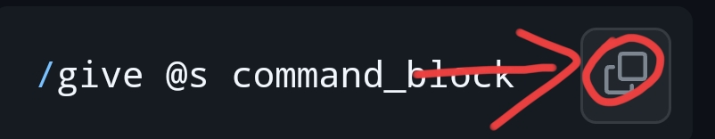

# 我的世界指令语弹
我的世界指令，收录kk键盘的语弹，欢迎推送
  
> - 更新版本：`0.1`
> - 最近更新：`2023/10/22`
> - [x] 不需要下载`kk键盘`
> - [x] 直接点击`复制`按钮，你就能获取`语弹`
> - [x] `免费`无`广告`，妈妈再也不用担心太多广告了

## 目录
* [补充](#补充)
    * 有github账号
    * 没有github账号
* [使用方法](#使用方法)
* [许可证](#许可证)
* [语弹](#语弹)
    * [方块获取](#基础获取物品指令)
    * [药水buff](#药水buff效果)

## 补充
- 如果你有`github`账号你就可以`fork`到你的仓库，然后更改，最后提交分支到我的`master`
- 如果你没有`github`账号，联系我的邮箱：`huangshaoqi8888@gmail.com`,或者去西瓜视频私信补充
  
## 使用方法
- 点击指令栏右边的复制按钮复制即可



## 许可证
[MIT](https://github.com/Github-Huangshaoqi/minecraft-code/blob/master/LICENSE)

Copyright (c) 2023 Github-huangshaoqi

# 语弹
> 暂时收录这么多
---
### 基础获取物品指令
> #### json语法格式
- 作者`不会`，请自行补充
> #### 给予自己命令方块
```python
/give @s command_block
```
> #### 给予自己结构方块
```python
/give @s stucture_block
```
> #### 给予自己屏障
```python
/give @s barrier
```
> #### 给予自己光明方块
```python
/give @s light_block
```
> #### 给予自己允许方块
```python
/give @s allow
```
> #### 给予自己拒绝方块
```python
/give @s deny
```
> #### 给予自己NPC弹
```python
/give @s spawn_egg
```
### 药水buff效果
##### 如果不想要无限时间，把99999改为你要的时间(单位：秒)
> #### 夜视 (无线持续时间)
```python
/effect @s night_vision 99999
```
> #### 急迫 (无线持续时间)
```python
/effect @s haste 99999
```
> #### 力量 1 (无线持续时间)
```python
/effect @s strength 99999 10
```
> #### 力量 2 (无线持续时间)
```python
/effect @s strength 99999 20
```
> #### 力量 3 (无线持续时间)
```python
/effect @s strength 99999 100
```
> #### 速度 1 (无线持续时间)
```python
/effect @s speed 99999 10
```
> #### 速度 2 (无线持续时间)
```python
/effect @s speed 99999 5
```
> #### 瞬间治疗 (无线持续时间)
```python
/effect @s instanthealth 99999 255
```
> #### 跳跃提升 1 (无线持续时间)
```python
/effect @s jump bot 99999 3
```
> #### 跳跃提升 2 (无线持续时间)
```python
/effect @s jump bot 99999 5
```
> #### 跳跃提升 3 (无线持续时间)
```python
/effect @s jump bot 99999 10
```
> #### 跳跃提升 4 (无线持续时间)
```python
/effect @s jump bot 99999 30
```
